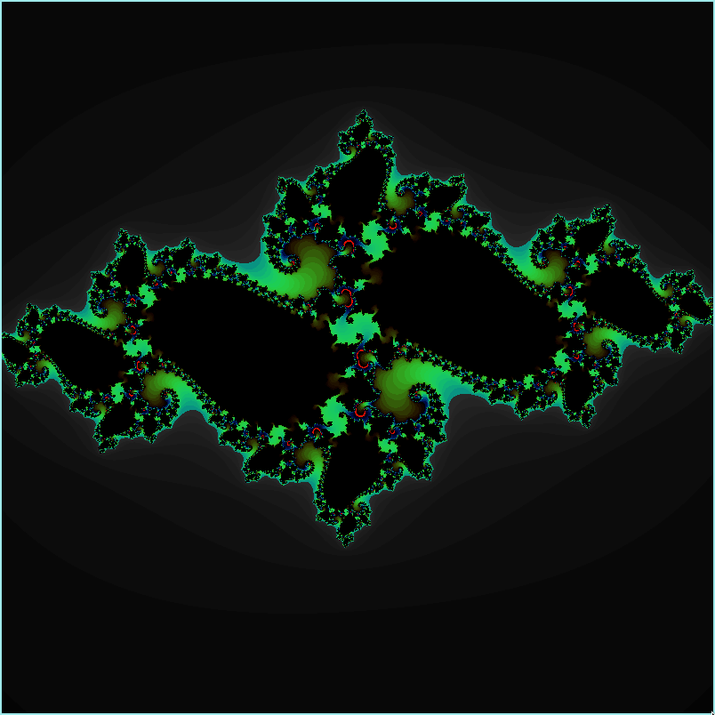
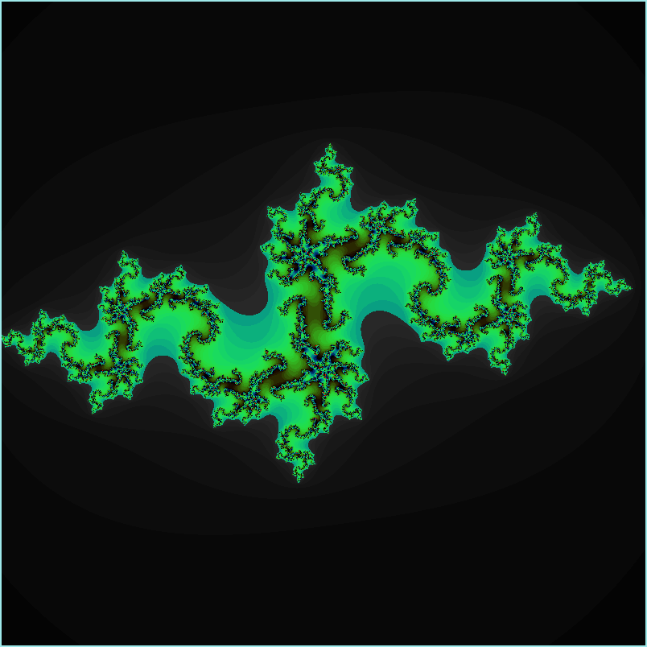
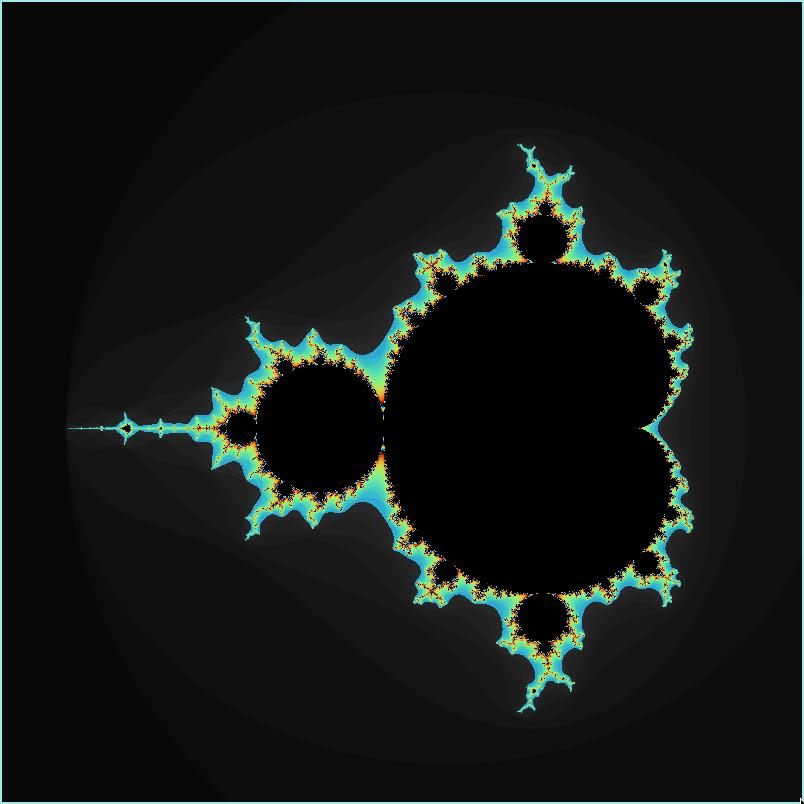
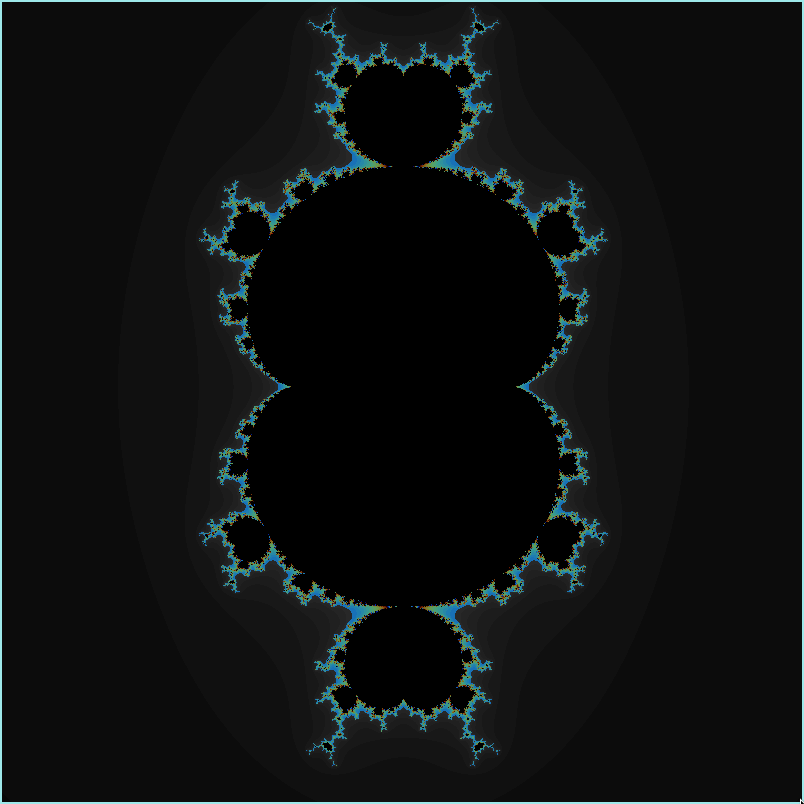

# fract’ol - Computer Graphics Fractals.

A beautiful fractal renderer built in C using the MLX42 library. This project visualizes a variety of fractals, including the Julia, Mandelbrot, and Multibrot sets.






---

### Install

```
git clone https://github.com/julmajustus/fractol.git
cd fractol && make bonus
```
---

### Usage

Run the executable with the appropriate arguments to select and customize the fractal you wish to render.
- Mandelbrot:
```
./fractol mandelbrot
```
- Multibrot:
```
./fractol multibrot
```
- Julia:
```
./fractol julia <real_part> <imaginary_part>
```
- The <real_part> and <imaginary_part> values should be floating-point numbers between -2.0 and 2.0.

### Example
To launch the Julia set with custom constants:
```
./fractol julia 0.285 0.01
```

---

### Controls
General Controls
   - ESC: Exit the program
   - W, A, S, D: Move the view within the window
   - Mouse Scroll: Zoom in/out
   - R: Reset the colorset to the default (black/white)
   - Space: Randomize the colorset

Julia Set Specific Controls

   - UP/DOWN Arrow Keys: Increase or decrease the constants
   - LEFT/RIGHT Arrow Keys: Finer adjustments to the constants


